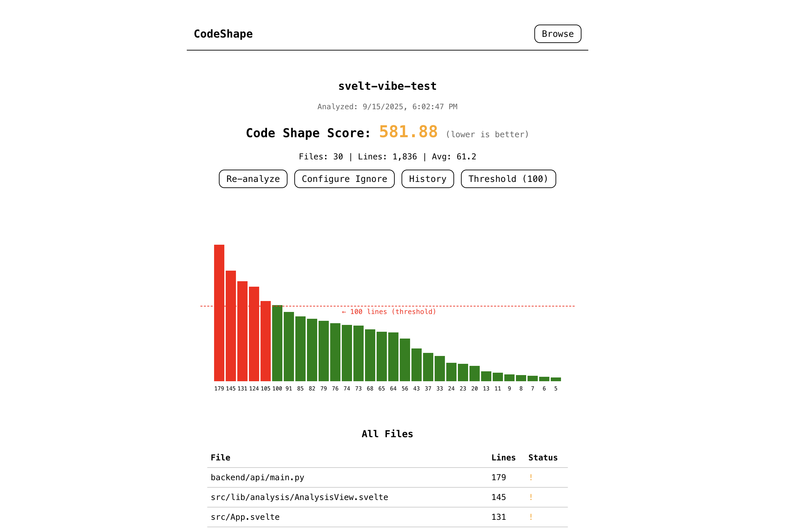

# CodeShape

A visual codebase analyzer that helps you understand and improve your code architecture by analyzing file sizes, complexity, and overall code shape.



## Features

- **Visual Code Analysis**: Interactive visualization of your codebase structure
- **Code Shape Score**: Quantitative metric for code health (lower is better)
- **Per-Project Thresholds**: Customize file size thresholds for each project
- **History Tracking**: Track code shape improvements over time
- **Ignore Patterns**: Configure which files/folders to exclude from analysis
- **Real-time Analysis**: Instantly analyze any directory on your system

## Tech Stack

- **Frontend**: Svelte 5, Vite
- **Backend**: FastAPI (Python)
- **Storage**: JSON file-based persistence

## Installation

### Prerequisites

- Node.js 18+
- Python 3.11+
- npm or yarn

### Setup

1. Clone the repository:

```bash
git clone <repository-url>
cd svelt-vibe-test
```

2. Install frontend dependencies:

```bash
npm install
```

3. Install backend dependencies:

```bash
pip3 install -r requirements.txt
```

## Running the Application

### Quick Start

Use the provided start script to run both frontend and backend:

```bash
./start.sh
```

This will start both servers in the background. The application will be available at `http://localhost:5173`

### Manual Start

Alternatively, you can start each server manually:

1. Start the backend server:

```bash
python3 run_backend.py
```

The API will be available at `http://localhost:8001`

2. In a new terminal, start the frontend development server:

```bash
npm run dev
```

The application will be available at `http://localhost:5173`

## Usage

1. **Browse**: Navigate to any directory on your system using the file browser
2. **Analyze**: Click "Analyze" on a directory to generate a code shape analysis
3. **Configure Threshold**: Set custom line thresholds per project (default: 100 lines)
4. **View History**: Track how your code shape changes over time
5. **Configure Ignores**: Set patterns to exclude files/folders from analysis

## Code Shape Score

The Code Shape Score is calculated based on:

- Total number of files (10 points per file)
- Total lines of code (0.1 points per line)
- Files exceeding threshold (exponential penalty for oversized files)

Lower scores indicate better code organization.

## Project Structure

```
svelt-vibe-test/
├── src/
│   ├── lib/
│   │   ├── analysis/       # Analysis components
│   │   ├── browser/        # File browser components
│   │   ├── navigation/     # Navigation components
│   │   ├── settings/       # Settings components
│   │   └── visualization/  # Visualization components
│   ├── App.svelte          # Main application component
│   └── main.js            # Application entry point
├── backend/
│   ├── api/               # FastAPI routes
│   ├── models/            # Data models
│   └── utils/             # Utility functions
├── codebase_data/         # Analysis data storage
└── package.json
```

## API Endpoints

- `POST /analyze` - Analyze a codebase
- `GET /history/{codebase_id}` - Get analysis history
- `GET /latest/{codebase_id}` - Get latest analysis
- `GET /project-settings/{project_id}` - Get project settings
- `POST /project-settings/{project_id}` - Save project settings
- `GET /browse` - Browse filesystem
- `GET /codebases` - List all analyzed codebases

## Development

### Building for Production

```bash
npm run build
```

### Running Tests

```bash
npm test
```

## Configuration

### Ignore Patterns

Default ignore patterns include:

- `node_modules`
- `.git`
- `dist`
- `build`
- `.next`
- `.cache`
- `coverage`
- `.env*`
- `*.min.js`
- `*.min.css`

You can configure additional patterns through the UI for each project.
